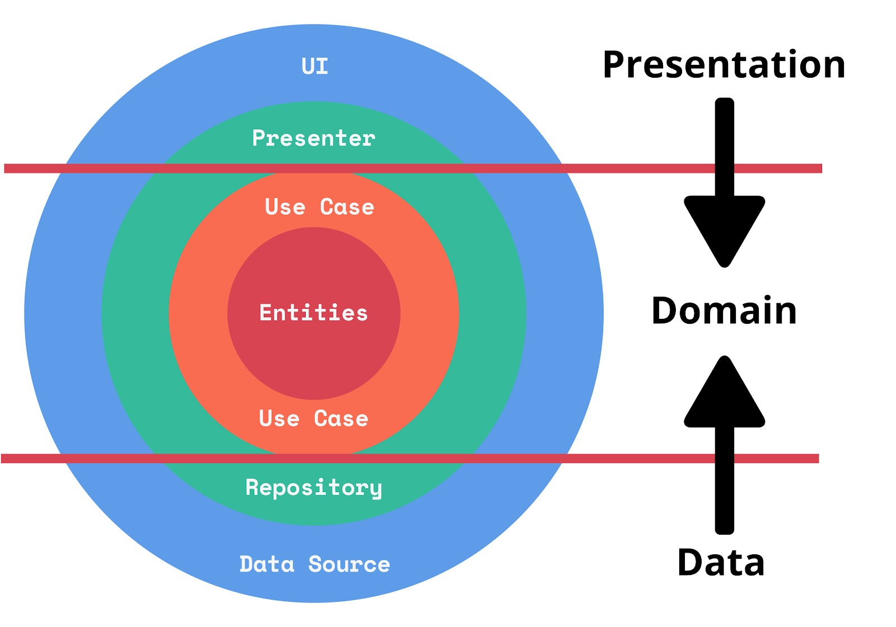

# The Animal App

## Requirement
- XCode 14+
- Swift 5+

## Library Dependencies
- Alamofire 5.0.0
- SwiftUI CachedAsyncImage

## Architecture Pattern
This project use Clean Architecture for the pattern. The main idea of using Clean Architecture is to produce a system that:
- **Independent of Framework:** This does not depend on the implementation of the framework used and places the framework only as a tool.
- **Testable:** Code for business processes is testable without the need for UI, databases, or other external elements.
- **Independent of UI:** UI can be changed easily, without the need to change the whole system.
- **Independent of Database:** This does not depend on a particular database framework and can be replaced easily.
- **Independent of External:** The existing business process does not need to know what is outside it.

This is an overview to represent Clean Architecture:

## Dependency Rule Clean Architecture

Ensure that the Domain Layer (inner) does not access classes in the Presentation Layer and Data Layer (outer). But it's the outer class that accesses the inner class. By maintaining this rule, any changes to the Presentation Layer and Data Layer will not affect the Domain Layer. In conclusion, if we apply these rules, the application becomes independent, maintainable, and scalable.
